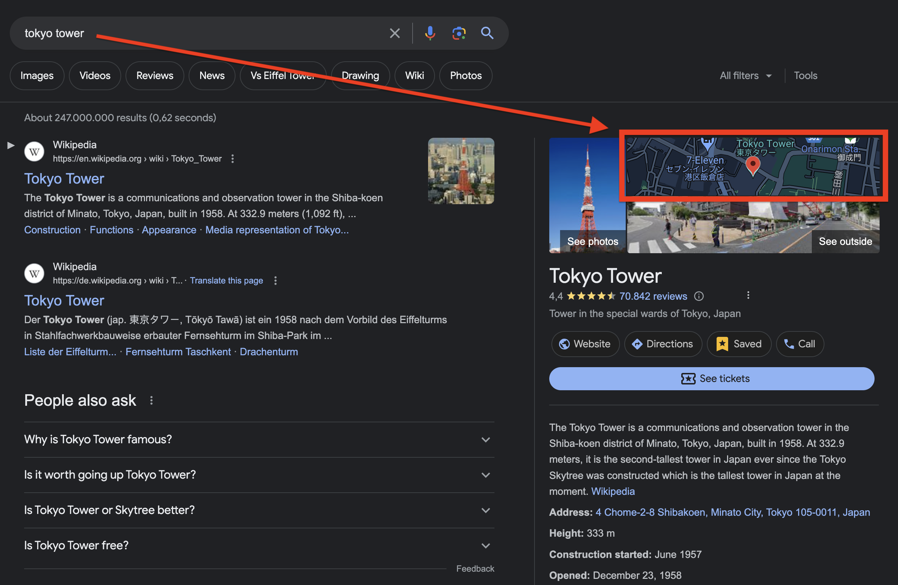

# gsearch-gmaps-link

[https://www.buymeacoffee.com/rhozacc](https://www.buymeacoffee.com/rhozacc)

I got annoyed that when clicking the map box on a Google Search result it doesn't take you to a Google Maps location anymore. Using this extension, when clicking on map box in a Google Search results it opens Google Maps like it used to:

# Installation

1. Download [gsearch-gmaps-link](https://github.com/rhozacc/gsearch-gmaps-link/archive/refs/tags/v1.zip). Due to Chrome blocking you from downloading `.crx` files, you download `source code` zip, and unzip the repository.
2. Go to `chrome://extensions`
3. Enable \_Developer Mode \_Once you've enabled Developer Mode, you'll see additional options appear.
4. Click on the **Load unpacked** button. A file dialog will open. Navigate to the location where you downloaded the `gsearch-gmaps-link.crx` file and select it. Once installed, you should see the extension appear in the list of installed extensions on the Extensions page.
5. **Verify Installation.** You should now see the extension icon in the Chrome toolbar. You can also verify that the extension is installed and enabled by checking the Extensions page. Navigate to Google search results and look for a map box element. Click on the map box, and it should open Google Maps with the corresponding search query.

By following these steps, you should be able to successfully install and use the `gsearch-gmaps-link` extension in Chrome. If you have any questions or encounter any issues during the installation process, feel free to ask!
